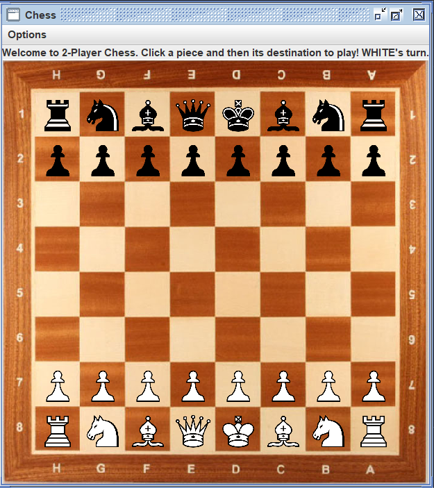
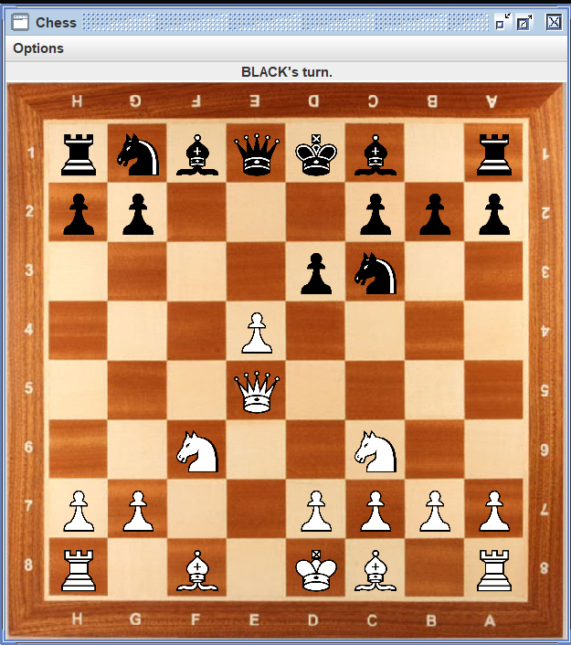

# Two Player Chess

A GUI based chess game developed with java that allows users to play chess with their friends. Built for the love for chess, this application provides everything a basic chess set has.

## Feautures

* All Standard Rules of Chess
* Neat UI design
* Includes Undo function
* Includes Pawn promotion

## Screenshots (Android)

 

